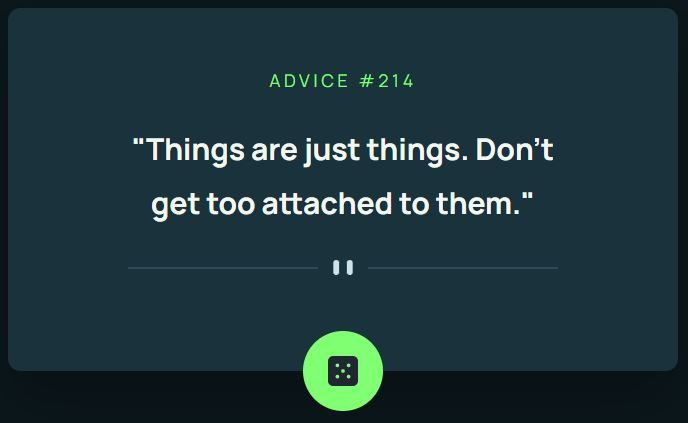

# Simple advice generator application.

This application generates advices by pressing a button. It was built using HTML, CSS and JavaScript.

It is the first of many applications soon to be built as challenges from FrontendMentor.

Code: https://github.com/adelindascalu/advice-generator-by-axd

Live preview: [LIVE](https://axd-advice-generator.netlify.app/)
